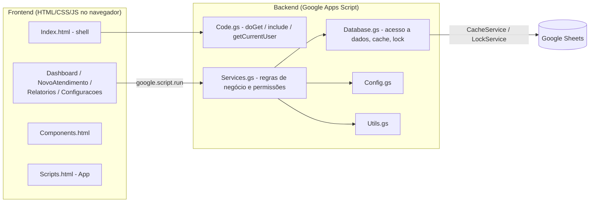

# Portobank RA — Sistema de Gestão de Atendimentos (Reclame Aqui)

## Descrição do projeto

Sistema corporativo da célula de **Reclame Aqui** do Portobank para gestão dos atendimentos
dos produtos **Cartão de Crédito** e **Conta Digital**, recebidos pelos canais **Reclame Aqui**
e **SAC Preventivo**. Permite que analistas cadastrem, acompanhem e concluam seus próprios
atendimentos, e que supervisores tenham visão completa da operação, podendo criar atendimentos
e delegá-los a analistas — tudo com histórico auditável de alterações.

O projeto roda inteiramente na plataforma **Google Apps Script**, usando uma planilha do
**Google Sheets** como banco de dados, sem nenhuma infraestrutura externa.

## Tecnologias

- **Google Apps Script** (JavaScript no servidor, runtime V8)
- **Google Sheets** (persistência dos dados)
- **HTML5 / CSS3 / JavaScript** (frontend, SPA sem frameworks)
- **SheetJS** e **jsPDF** (via CDN, apenas para exportação de relatórios em Excel/PDF)

## Estrutura do projeto

O projeto é "flat" (todos os arquivos na raiz), como exigido pelo Google Apps Script/clasp.

### Backend (`.gs`)

| Arquivo | Responsabilidade |
| --- | --- |
| [Code.gs](Code.gs) | Ponto de entrada do Web App (`doGet`), inclusão de arquivos HTML (`include`), identificação do usuário logado (`getCurrentUser`), menu da planilha (`onOpen`, `abrirSistema`) e funções de setup/manutenção. |
| [Config.gs](Config.gs) | Constantes de configuração (`CONFIG`), colunas de cada aba (`COLUMNS`), listas fixas do fluxo (`STATUS_LIST`, `SITUACOES_PENDENCIA`, `CANAIS_LIST`) e dados padrão de produtos/categorias. |
| [Database.gs](Database.gs) | Camada de acesso a dados: leitura/escrita no Google Sheets, cache (`CacheService`), lock de concorrência (`LockService`), inicialização automática das planilhas e migração de dados legados (`migrateLegacyData_`). |
| [Services.gs](Services.gs) | Regras de negócio: CRUD de atendimentos, alteração rápida de status, timeline/histórico, dashboard, relatórios, configurações administráveis e **controle de permissões (Analista x Supervisor)**. |
| [Utils.gs](Utils.gs) | Utilitários: geração de IDs, validação/formatação de CPF, sanitização de entradas e conversão de dados. |

### Frontend (`.html`)

O frontend é uma SPA montada pelo Apps Script através de
`HtmlService.createTemplateFromFile('Index')`. O [Index.html](Index.html) é a "casca" do
sistema (menu lateral e cabeçalho) e usa `<?!= include('Arquivo') ?>` para colar os demais
arquivos dentro dele, nesta ordem: `Styles` → `Scripts` → `Components` → páginas.

| Arquivo | Responsabilidade |
| --- | --- |
| [Index.html](Index.html) | Casca do sistema: layout e inclusão dos demais arquivos HTML. |
| [Styles.html](Styles.html) | Design system e estilos globais (CSS). |
| [Scripts.html](Scripts.html) | Núcleo do frontend (`App`): navegação entre páginas, usuário logado, helpers compartilhados (datas, CPF, escapeHtml) e visibilidade por perfil. |
| [Components.html](Components.html) | Componentes de UI reutilizáveis: modal, toast, badges, tabela, paginação, timeline, KPIs. |
| [Dashboard.html](Dashboard.html) | Página inicial: KPIs + lista de atendimentos com **alteração de status direto na tabela**. |
| [NovoAtendimento.html](NovoAtendimento.html) | Cadastro e edição de atendimentos (ver campos abaixo). |
| [Relatorios.html](Relatorios.html) | Única tela com filtros; geração de relatórios com exportação (Excel/CSV e PDF) e painel de produtividade. |
| [Configuracoes.html](Configuracoes.html) | Administração de Produtos, Categorias e Usuários — acesso restrito a Supervisores. |

### Outros arquivos

- [appsscript.json](appsscript.json) — manifesto do Apps Script (timezone, escopos OAuth, runtime V8).
- [.clasp.json.example](.clasp.json.example) — modelo para o arquivo `.clasp.json` (não versionado).
- [.claspignore](.claspignore) — define que apenas `*.gs`, `*.html` e `appsscript.json` são sincronizados via clasp.

## Como executar

### Pré-requisitos

```
npm install -g @google/clasp
clasp login
```

### Clonar/associar um projeto existente

```
clasp clone <SCRIPT_ID>
```

Ou, para um projeto novo, copie [.clasp.json.example](.clasp.json.example) para `.clasp.json`
e preencha o `scriptId` do seu projeto Apps Script.

### Enviar/trazer alterações

```
clasp push   # envia o código para o Apps Script
clasp pull   # traz alterações feitas no editor online
```

### Publicar (implantar como Web App)

1. `clasp push` para enviar o código mais recente.
2. `clasp deploy` (ou pelo editor: **Implantar → Nova implantação → Aplicativo da Web**).
3. Configurar a implantação com:
   - **Executar como:** Usuário que acessa o aplicativo da Web (necessário para que
     `Session.getActiveUser()` identifique corretamente cada analista/supervisor).
   - **Quem pode acessar:** restrito à organização (nunca "Qualquer pessoa").
4. Acessar a URL do Web App gerada.

Ao abrir a URL, o sistema inicializa automaticamente as planilhas (`ensureDatabaseReady`).
Instalações antigas são migradas automaticamente: abas descontinuadas (SLA, Prioridades,
Tipos de Atendimento, Parâmetros gerais etc.) são removidas e os status antigos são
normalizados para o novo fluxo.

## Estrutura do banco de dados

Todas as abas são criadas e mantidas automaticamente por `initializeSheets()` (em
[Database.gs](Database.gs)), com base nas definições de [Config.gs](Config.gs).

| Aba | Conteúdo |
| --- | --- |
| **Atendimentos** | Registro principal de cada atendimento (Protocolo Odin, cliente, CPF, produto, categoria, canal, status, situação da pendência, responsável, datas, observações, auditoria de criação/exclusão). |
| **Timeline** | Eventos cronológicos de cada atendimento (criação, mudança de status, delegação, observações, exclusão). |
| **Histórico** | Registro imutável (somente inserção) de toda alteração de campo, com valor anterior/novo, usuário e justificativa. |
| **Usuários** | Cadastro de analistas e supervisores (nome, e-mail, perfil, equipe, status). |
| **Produtos / Categorias** | Listas administráveis (Cartão de Crédito e Conta Digital, com suas categorias) usadas para classificar atendimentos. |

Status, situações de pendência e canais são **regras fixas do fluxo**, definidas em
[Config.gs](Config.gs) (não são abas da planilha nem administráveis pela interface):

- **Status:** `Pendente` e `Concluído`.
- **Situação da pendência** (obrigatória quando Pendente): `Em análise área`,
  `Em análise do analista`, `Em análise aguardando retorno do cliente`.
- **Canais:** `Reclame Aqui` e `SAC Preventivo`.

## Controle de usuários

O usuário logado é identificado automaticamente via `Session.getActiveUser().getEmail()`
e cruzado com a aba **Usuários** para obter nome e perfil (`getActor_()` em
[Services.gs](Services.gs)). Não há tela de login: o próprio Google Workspace autentica
o usuário ao abrir o Web App.

### Perfil Analista

- Visualiza **apenas** os atendimentos que criou ou dos quais é responsável (Dashboard e Relatórios).
- Pode criar atendimentos (o sistema o define automaticamente como responsável) e alterar o
  status dos seus atendimentos **diretamente pelo Dashboard**.
- Só pode editar ou excluir os próprios atendimentos.
- Essas regras são aplicadas **no backend** (`canAccessAtendimento_`, `restrictToOwnerIfNeeded_`
  em [Services.gs](Services.gs)), não apenas escondidas na interface.

### Perfil Supervisor

- Visualiza os atendimentos de **todos** os analistas.
- Pode criar um atendimento e **delegá-lo a um analista** (campo "Responsável", visível
  apenas para este perfil), além de reatribuir atendimentos existentes.
- Pode editar ou excluir qualquer atendimento.
- É o único perfil com acesso à tela de **Configurações** (Produtos, Categorias e Usuários).

## Fluxo do atendimento

1. **Cadastro** — o analista (ou supervisor) preenche o formulário em **Novo Atendimento**
   com: Protocolo Odin, CPF, nome do cliente, data, produto, categoria, canal, status e
   observações. O CPF é validado e o protocolo tem duplicidade verificada em tempo real.
2. **Status "Pendente"** — a **Situação da pendência** aparece e passa a ser obrigatória
   (Em análise área / Em análise do analista / Em análise aguardando retorno do cliente).
3. **Status "Concluído"** — a situação é ocultada e o atendimento é encerrado
   (data e tempo de resolução calculados automaticamente).
4. **Acompanhamento** — pelo Dashboard, o analista altera o status/situação diretamente na
   tabela, sem abrir o formulário.
5. **Timeline e Histórico** — toda criação, delegação, mudança de status ou edição gera um
   evento na Timeline e, quando altera um campo, uma linha imutável no Histórico
   (com justificativa obrigatória em edições pelo formulário).
6. **Relatórios** — única tela com filtros (período, analista, produto, categoria, status,
   situação, canal, protocolo, cliente e CPF), com exportação Excel/CSV e PDF e painel de
   produtividade por analista.
7. **Exclusão** — é lógica (campo `Excluido`), preservando o histórico para auditoria.

## Arquitetura



- O navegador nunca acessa o Google Sheets diretamente: toda comunicação passa por
  `google.script.run` chamando funções públicas de [Services.gs](Services.gs).
- [Services.gs](Services.gs) aplica as regras de negócio e permissão, e delega leitura/escrita
  para [Database.gs](Database.gs), que usa `CacheService` (performance) e `LockService`
  (concorrência segura) antes de tocar na planilha.

## Performance

- **Uma chamada por tela**: o Dashboard carrega KPIs + lista de atendimentos em uma única
  requisição (`getDashboardData`), e os dados de apoio dos formulários/filtros vêm de uma
  única chamada na inicialização (`getBootstrapData`).
- **Menos abas**: status, situações e canais são constantes em código — o bootstrap lê apenas
  3 abas (Produtos, Categorias, Usuários) em vez de 8.
- **Cache**: leituras de planilha passam pelo `CacheService` (5 min), invalidado a cada escrita.
- **Sem escritas ocultas**: o Dashboard e os Relatórios não gravam mais "snapshots"/logs na
  planilha a cada carregamento.
- **Skeletons em vez de overlay**: as telas mostram esqueletos de carregamento e mantêm a
  interface responsiva; o overlay bloqueante é usado apenas em gravações.

## Observações de segurança

- Identificação do usuário via `Session.getActiveUser().getEmail()`.
- Validação de permissão (Analista/Supervisor) aplicada no backend, não apenas na interface.
- Histórico (`Histórico`) é somente-inserção, sem exclusão.
- Exclusão de atendimentos é lógica (mantém rastro para auditoria).
- Entradas sanitizadas no servidor (`sanitizeInput`) e HTML escapado no cliente (`App.escapeHtml`).
- Ao implantar, configure o Web App para **não** liberar acesso anônimo — restrinja à
  organização/domínio.
