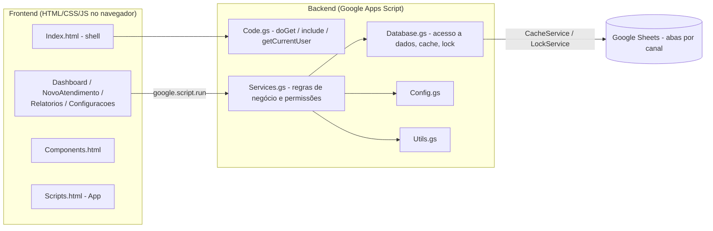

# Pelitero Labs Prisma RA

Sistema de gestão de atendimentos multicanal construído sobre Google Apps Script e
Google Sheets — sem servidores, sem banco de dados externo e sem custo de infraestrutura.

Desenvolvido por **Pelitero Labs**.

---

## Sobre

O **Prisma RA** é um produto da Pelitero Labs para equipes que tratam manifestações de
clientes recebidas por múltiplos canais — no cenário de exemplo, uma célula de
**Reclame Aqui**, com os canais *Reclame Aqui*, *Chat Privado do Reclame Aqui* e
*SAC Preventivo*. O sistema registra, distribui e acompanha cada atendimento até a
conclusão, com trilha de auditoria completa.

### Objetivos

- Centralizar o registro e o acompanhamento de atendimentos multicanal;
- Dar a cada perfil (ADM, Supervisor, Analista) exatamente o acesso de que precisa;
- Permitir que o formulário de cadastro seja **configurável sem alteração de código**;
- Manter histórico auditável de toda alteração (quem, quando, o quê e por quê);
- Rodar 100% dentro do Google Workspace, sem infraestrutura adicional.

### Tecnologias utilizadas

| Tecnologia | Papel |
| --- | --- |
| **Google Apps Script (V8)** | Backend: regras de negócio, permissões e persistência |
| **Google Sheets** | Banco de dados (abas como tabelas) |
| **HTML5 / CSS3 / JavaScript (ES6 no servidor, ES5 no cliente)** | Frontend SPA sem frameworks |
| **HtmlService / google.script.run** | Ponte navegador ↔ servidor |
| **CacheService / LockService / PropertiesService** | Performance, concorrência e versionamento |
| **Chart.js** | Gráficos interativos da tela Indicadores (via CDN) |
| **SheetJS (xlsx) e jsPDF** | Exportação de relatórios em Excel e PDF (via CDN) |

---

## Arquitetura

O projeto segue uma separação clara de camadas, mesmo dentro das restrições do Apps
Script (arquivos "flat" na raiz):



**Fluxo da aplicação:**

1. O usuário abre a URL do Web App; o Apps Script executa `doGet()` (Code.gs), que
   inicializa o banco (`ensureDatabaseReady`) e monta o `Index.html`;
2. O `Index.html` inclui estilos, scripts, componentes e páginas (SPA);
3. `App.init()` (Scripts.html) busca os dados de apoio em uma única chamada
   (`getBootstrapData`) e desenha a primeira página;
4. Cada página conversa com o servidor exclusivamente via `google.script.run`,
   chamando funções públicas de `Services.gs`;
5. `Services.gs` aplica permissões e regras de negócio e delega leitura/escrita a
   `Database.gs`, que usa cache e lock antes de tocar na planilha.

O navegador **nunca** acessa o Google Sheets diretamente.

---

## Estrutura do projeto

### Backend (`.gs`)

| Arquivo | Responsabilidade |
| --- | --- |
| [Code.gs](Code.gs) | Ponto de entrada do Web App (`doGet`), inclusão de HTML (`include`), usuário logado (`getCurrentUser`), menu da planilha e funções de setup/manutenção. |
| [Config.gs](Config.gs) | Configuração central: constantes (`CONFIG`, `PROPERTY_KEYS`), colunas de cada aba (`COLUMNS`), listas fixas do fluxo (`STATUS_LIST`, `SITUACOES_PENDENCIA`, `CANAIS_LIST`, `CANAL_SHEETS`) e dados padrão (catálogo e campos do formulário). |
| [Database.gs](Database.gs) | Camada de acesso a dados: leitura/escrita no Google Sheets, cache (`CacheService`), lock (`LockService`), criação automática das abas e migrações versionadas de dados legados. |
| [Services.gs](Services.gs) | Regras de negócio: CRUD de atendimentos nas abas por canal, formulário dinâmico, timeline/histórico, dashboard, relatórios, configurações e **controle de permissões**. |
| [Utils.gs](Utils.gs) | Funções auxiliares puras: geração de IDs, validação/formatação de CPF, sanitização e conversão objeto ↔ linha. |

### Frontend (`.html`)

| Arquivo | Responsabilidade |
| --- | --- |
| [Index.html](Index.html) | Shell da aplicação: layout (sidebar + header) e inclusão dos demais arquivos. |
| [Styles.html](Styles.html) | Design system e estilos globais (variáveis CSS, layout, responsividade, cards, tabelas). |
| [Scripts.html](Scripts.html) | Núcleo do frontend (`App`): navegação SPA, usuário logado, visibilidade por perfil e helpers compartilhados. |
| [Components.html](Components.html) | Componentes de UI reutilizáveis: modal, toast, badges, tabela, paginação, timeline, KPIs. |
| [Dashboard.html](Dashboard.html) | Dashboard principal: KPIs, indicadores por canal, **tabela dinâmica** de atendimentos e **edição em modal** (sem sair da tela). |
| [NovoAtendimento.html](NovoAtendimento.html) | Módulo compartilhado `AtendimentoForm` (formulário dinâmico via ConfigCampos) + página de criação/edição em tela cheia. |
| [Relatorios.html](Relatorios.html) | Filtros, relatórios, exportação Excel/CSV/PDF e painel de produtividade. |
| [Indicadores.html](Indicadores.html) | Painel analítico da supervisão: 8 gráficos Chart.js e cards de resumo, todos reagindo aos filtros. |
| [Configuracoes.html](Configuracoes.html) | Administração de Produtos, Categorias, Usuários e Campos do formulário, com acesso por perfil. |

### Outros arquivos

| Arquivo | Papel |
| --- | --- |
| [appsscript.json](appsscript.json) | Manifesto do Apps Script (timezone, escopos OAuth, runtime V8). |
| [.clasp.json.example](.clasp.json.example) | Modelo do `.clasp.json` (o real não é versionado). |
| [.claspignore](.claspignore) | Sincroniza via clasp apenas `*.gs`, `*.html` e `appsscript.json`. |
| [.gitignore](.gitignore) | Exclui credenciais e artefatos locais do versionamento. |

---

## Funcionalidades

- Cadastro, edição, exclusão (lógica) e acompanhamento de atendimentos;
- **Formulário configurável** pelo ADM sem alteração de código (aba ConfigCampos);
- **Tabela dinâmica** no Dashboard: novos campos criados na configuração aparecem
  automaticamente como colunas, sempre na ordem Data → Cliente → CPF → Produto →
  Categoria → Responsável → campos adicionais → Ações;
- **Edição em modal** direto no Dashboard: carrega todos os dados, valida, salva sem
  recarregar a página e atualiza a tabela mantendo o usuário na tela;
- **Painel de Indicadores** (supervisão) com 8 gráficos Chart.js e filtros reativos;
- **Sistema de temas** (Azul, Rosa, Brasil e Dark) com persistência em localStorage;
- Armazenamento **separado por canal** com consulta consolidada e transparente;
- Alteração rápida de status direto na tabela do Dashboard;
- Delegação/reatribuição de atendimentos entre analistas (Supervisor/ADM);
- Verificação de protocolo duplicado em tempo real (nas três abas);
- Validação de CPF no cliente e no servidor;
- Timeline por atendimento e histórico imutável de alterações com justificativa;
- Dashboard com KPIs e gráficos por canal;
- Relatórios com filtros combinados, exportação Excel/CSV/PDF e ranking de produtividade;
- Controle de acesso por perfil aplicado no backend;
- Migrações automáticas e versionadas do banco (schema, catálogo e propriedades).

---

## Fluxo do atendimento

Status fixos do fluxo: **Pendente → Em análise → Concluído**.

1. **Cadastro** — o formulário é montado conforme a ConfigCampos; o registro é gravado
   na aba do canal selecionado. Analista é definido automaticamente como responsável;
   Supervisor/ADM podem delegar.
2. **Tratativa** — a equipe acompanha pelo Dashboard e altera status/observações sem
   abrir o formulário completo.
3. **Pendência** — quando o status é **Pendente**, o campo **"Aguardando Retorno de"**
   torna-se obrigatório, com duas opções: **Área** ou **Cliente**. Nos demais status o
   campo fica oculto.
4. **Conclusão** — ao marcar **Concluído**, o sistema grava data de resolução e calcula
   o tempo de resolução em horas. Reabrir o atendimento limpa esses campos.

Toda criação, mudança de status, delegação, observação ou edição gera eventos na
**Timeline**; alterações de campo geram linhas imutáveis no **Histórico**, com
justificativa obrigatória em edições pelo formulário.

---

## Controle de usuários

A identificação é automática: o e-mail da sessão Google (`Session.getActiveUser()`) é
cruzado com a aba **Usuários**. Não há tela de login. Todas as regras são aplicadas
**no backend**, não apenas escondidas na interface.

| Capacidade | ADM | Supervisor | Analista |
| --- | :-: | :-: | :-: |
| Ver todos os atendimentos | ✅ | ✅ | ❌ (só os seus) |
| Criar atendimentos | ✅ | ✅ | ✅ |
| Editar qualquer atendimento | ✅ | ✅ | ❌ (só os seus) |
| Reatribuir/delegar a analistas | ✅ | ✅ | ❌ |
| Dashboards e relatórios | ✅ | ✅ | ✅ (só os seus dados) |
| Administrar produtos/categorias | ✅ | ✅ | ❌ |
| **Gerenciar usuários** | ✅ | ❌ | ❌ |
| **Configurar campos do formulário** | ✅ | ❌ | ❌ |

O primeiro usuário é criado automaticamente como **ADM** e o sistema impede a
desativação/demoção do último ADM ativo.

---

## Banco de dados (abas do Google Sheets)

Todas as abas são criadas e mantidas por `initializeSheets()` (Database.gs), a partir
das definições de colunas em Config.gs.

| Aba | Conteúdo |
| --- | --- |
| **ReclameAqui / ChatPrivadoRA / SACPreventivo** | Atendimentos de cada canal — mesmas colunas nas três abas (protocolo, cliente, CPF, produto, categoria, canal, status, aguardando retorno, responsável, datas, observações, `CamposExtras` em JSON e auditoria de criação/exclusão). O *Chat Privado* faz parte do Reclame Aqui, mas tem aba própria para controle operacional. |
| **ConfigCampos** | Configuração dinâmica do formulário (campo, rótulo, tipo, exibir, obrigatório, ordem, base/bloqueado). |
| **Timeline** | Eventos cronológicos de cada atendimento. |
| **Histórico** | Registro imutável (somente inserção) de alterações, com valor anterior/novo, usuário e justificativa. |
| **Usuários** | Nome, e-mail, perfil (ADM/Supervisor/Analista), equipe e status. |
| **Produtos / Categorias** | Catálogo administrável para classificação dos atendimentos. |

**Migrações automáticas** (executadas uma única vez, controladas por Script
Properties versionadas): estrutura das abas (`SCHEMA_VERSION`), movimentação dos
atendimentos legados para as abas por canal, normalização de status e catálogo, e
migração das chaves de propriedades de versões anteriores do produto.

---

## Segurança

- **Permissões no servidor**: toda função pública de `Services.gs` revalida o perfil do
  usuário (`getActor_`, `canAccessAtendimento_`, `requireSupervisor_`, `requireAdmin_`)
  — esconder um botão no frontend nunca é a única barreira;
- **Controle por usuário**: Analista só acessa registros dos quais é criador ou
  responsável, em consultas **e** gravações;
- **Registro de histórico**: aba Histórico é somente-inserção; exclusões de
  atendimento são lógicas, preservando a trilha de auditoria;
- **Sanitização**: entradas passam por `sanitizeInput` no servidor e todo HTML montado
  no cliente usa `App.escapeHtml` (prevenção de XSS);
- **Concorrência**: gravações críticas (protocolo único, movimentação entre abas)
  acontecem sob `LockService`;
- **Implantação**: o Web App deve executar "como o usuário que acessa" e com acesso
  restrito à organização — nunca anônimo.

---

## Dashboard

Indicadores consolidados das três abas de canal, em uma única chamada ao servidor:

- **KPIs gerais**: total de atendimentos, pendentes, em análise, concluídos e
  pendências por "Aguardando Retorno de" (Área/Cliente);
- **Por canal**: cartões com total e barras proporcionais de pendentes / em análise /
  concluídos para Reclame Aqui, Chat Privado e SAC Preventivo;
- **Tabela dinâmica**: as colunas seguem sempre a ordem Data, Cliente, CPF, Produto,
  Categoria, Responsável e, na sequência, os demais campos visíveis da ConfigCampos
  (status, aguardando retorno, protocolo, canal, observações e campos criados pelo
  ADM) — com Ações sempre por último;
- **Filtros individuais combináveis** em painel **recolhível**: Data Inicial/Final,
  Protocolo, Cliente, CPF, Produto, Categoria, Canal, Status, Aguardando Retorno e
  Responsável, aplicados em conjunto (E lógico) sobre os dados já carregados — sem
  novas chamadas ao servidor. O cabeçalho exibe um **contador de filtros ativos** e
  os filtros aplicados aparecem como **chips removíveis** individualmente, visíveis
  mesmo com o painel fechado. A **pesquisa rápida** localiza registros por qualquer
  informação visível na tabela, inclusive campos personalizados. "Limpar Filtros"
  devolve a tabela ao estado original;
- **Coluna "Aberto há"**: idade do caso em dias com badge de cor gradual e
  discreta (neutro até 3 dias, âmbar de 4 a 7, vermelho suave acima de 7) —
  destaca os casos que precisam de atenção sem alarmar. Concluídos exibem "—";
- **KPIs clicáveis**: um toque em Pendentes, Em análise, Concluídos ou
  Aguardando Retorno aplica o filtro correspondente e rola até a tabela;
- **Filtros rápidos**: atalhos de um clique acima da tabela — Meus pendentes
  (exibido quando o usuário logado é um responsável), Aguardando Cliente,
  Aguardando Área, Abertos hoje e Todos;
- **Textos longos**: células com mais de 40 caracteres (ex.: Assunto, Observações)
  são truncadas com "…" — o clique abre um modal com o conteúdo completo,
  selecionável e com botão de copiar;
- **Paginação completa**: 10/25/50/100 registros por página, navegação
  Primeira/Anterior/Próxima/Última e resumo "Exibindo X até Y de Z registros".
  Apenas a página atual é renderizada (performance com grandes volumes);
- **Rolagem confortável**: a tabela rola dentro do próprio card (altura máxima de
  65% da janela) com cabeçalho fixo; as barras de rolagem ficam sempre visíveis e
  ao alcance, sem precisar ir até a extremidade da janela;
- **Edição em modal**: o botão Editar abre um modal com o formulário completo
  (mesmo `AtendimentoForm` da tela Novo Atendimento), exige justificativa, salva sem
  recarregar a página e atualiza a tabela mantendo o usuário no Dashboard.

## Indicadores (supervisão)

Tela exclusiva de Supervisor/ADM com análise visual da operação (Chart.js):

- **Filtros**: Data Inicial/Final, Produto, Categoria, Canal, Responsável, Status e
  "Aguardando Retorno de" — qualquer mudança atualiza automaticamente todos os
  gráficos e cards;
- **Cards de resumo**: Total, Pendentes, Em análise, Concluídos, Aguardando Área e
  Aguardando Cliente;
- **Gráficos**: atendimentos por dia (linha), por produto (barras), por categoria
  (barras), por canal (pizza), por responsável (barras horizontais — **Top 10 +
  "Outros (N)"**, apenas na exibição do gráfico; relatórios, produtividade e
  exportações continuam com todos os analistas), por status (pizza), aguardando
  retorno Área x Cliente (rosca) e evolução diária acumulada no período (linha);
- As cores de texto/grade dos gráficos acompanham o tema ativo (inclusive Dark).

## Sistema de Temas

Quatro temas trocáveis pelo seletor no cabeçalho, aplicados via variáveis CSS
(`body[data-theme]`) a toda a interface — sidebar, cabeçalho, rodapé, cards,
tabelas, botões, modais e inputs:

| Tema | Identidade |
| --- | --- |
| **Azul** (padrão) | Azul corporativo |
| **Rosa** | Tons de rosa/magenta |
| **Brasil** | Verde, amarelo e azul |
| **Dark** | Superfícies escuras com azul vibrante |

A escolha é persistida em `localStorage` (`prisma-ra-theme`) e restaurada
automaticamente na próxima abertura.

---

## Como executar

### Pré-requisitos

```bash
npm install -g @google/clasp
clasp login
```

### Associar a um projeto Apps Script

```bash
# Projeto existente:
clasp clone <SCRIPT_ID>

# Ou projeto novo: copie o modelo e preencha o scriptId
cp .clasp.json.example .clasp.json
```

### Sincronizar o código

```bash
clasp push   # envia o código local para o Apps Script
clasp pull   # traz alterações feitas no editor online
```

### Deploy / Publicação

1. `clasp push` para enviar o código mais recente;
2. `clasp deploy` (ou, pelo editor: **Implantar → Nova implantação → Aplicativo da Web**);
3. Configurar a implantação:
   - **Executar como:** usuário que acessa o aplicativo (necessário para identificar
     cada usuário e seu perfil);
   - **Quem pode acessar:** restrito à organização;
4. Acessar a URL gerada — na primeira abertura o sistema cria as abas e executa as
   migrações automaticamente (`ensureDatabaseReady`).

---

## Estrutura de pastas

O Google Apps Script exige estrutura "flat" (todos os arquivos na raiz):

```
pelitero-labs-prisma-RA/
├── appsscript.json        # Manifesto do Apps Script
├── Code.gs                # Ponto de entrada (doGet, include, menu)
├── Config.gs              # Constantes, colunas e listas fixas do fluxo
├── Database.gs            # Acesso a dados, cache, lock e migrações
├── Services.gs            # Regras de negócio e permissões
├── Utils.gs               # Funções auxiliares puras
├── Index.html             # Shell da SPA
├── Styles.html            # Design system (CSS) + sistema de temas
├── Scripts.html           # Núcleo do frontend (App, navegação, temas)
├── Components.html        # Componentes de UI reutilizáveis
├── Dashboard.html         # Página: dashboard (tabela dinâmica + modal de edição)
├── NovoAtendimento.html   # AtendimentoForm compartilhado + página de cadastro
├── Relatorios.html        # Página: relatórios e exportações
├── Indicadores.html       # Página: gráficos analíticos da supervisão
├── Configuracoes.html     # Página: administração
├── .clasp.json.example    # Modelo de configuração do clasp
├── .claspignore           # Arquivos sincronizados com o Apps Script
└── .gitignore             # Arquivos fora do versionamento
```

---

## Melhorias implementadas

- Painel **Indicadores** com 8 gráficos Chart.js e filtros 100% reativos;
- **Sistema de temas** (Azul, Rosa, Brasil, Dark) com persistência da preferência;
- **Tabela dinâmica** no Dashboard — colunas geradas a partir da ConfigCampos, com
  novos campos aparecendo automaticamente e Ações sempre por último;
- **Edição em modal** no Dashboard, sem navegação nem recarga de página;
- Refatoração DRY: módulo `AtendimentoForm` compartilhado entre a página Novo
  Atendimento e o modal de edição (uma única fonte da verdade para o formulário);
- Modais com suporte a validação (`onConfirm` pode manter o modal aberto);
- Busca do Dashboard passou a cobrir também os campos personalizados;
- **Filtros individuais no Dashboard** (11 filtros combináveis + pesquisa rápida),
  aplicados client-side sobre os dados já carregados;
- **`Components.longText`**: célula truncada com "…" + modal com o texto completo
  (selecionável e copiável) — comportamento consistente em todas as tabelas;
- **`Components.paginationBar`**: paginação reutilizável com 10/25/50/100 por
  página, Primeira/Anterior/Próxima/Última e "Exibindo X até Y de Z registros",
  usada no Dashboard e nos Relatórios (o relatório renderiza apenas a página
  atual; as exportações continuam usando o conjunto completo);
- **Tabelas com rolagem interna**: cabeçalho fixo (sticky) e barras de rolagem
  sempre visíveis dentro do container da tabela;
- **Indicadores**: rótulos longos dos gráficos de Produto, Categoria e Responsável
  truncados com "…" nos eixos, mantendo o nome completo no tooltip.

## Correções realizadas

- **Contador da tabela do Dashboard invisível**: a classe `.badge` tinha texto
  branco sem cor de fundo padrão — o número ao lado de "Atendimentos" não aparecia.
  Corrigido com fundo padrão na cor primária do tema;
- **Datas deslocadas em um dia**: strings `AAAA-MM-DD` eram interpretadas como UTC
  (fuso do Brasil exibia o dia anterior). Novo `App.parseDate` trata datas puras
  como horário local;
- **Perda de dados em campos ocultos**: editar um atendimento apagava valores de
  campos que o ADM ocultou na ConfigCampos (base e personalizados). O servidor agora
  preserva os valores existentes (`preserveHiddenFields_` em Services.gs);
- **Sidebar não acompanhava o tema**: o gradiente era fixo no CSS; passou a usar as
  variáveis do tema;
- **Lógica duplicada removida**: escape de HTML centralizado em `App.escapeHtml` e
  resquícios de migrações da marca anterior eliminados;
- **Filtro retido ao voltar para o Dashboard**: o estado da página (SPA) persiste
  entre navegações, mas os campos de filtro renascem vazios — ao sair e voltar, a
  tabela continuava filtrada pela última pesquisa. O estado agora é zerado a cada
  render;
- **"Limpar Filtros" dos Relatórios não limpava o resultado**: apenas os inputs
  eram esvaziados; o relatório anterior permanecia na tela e em memória
  (`_reportData`). Agora o estado interno é zerado e a área de resultados é
  ocultada.

## Próximas evoluções

- Notificações por e-mail em delegações e estouro de prazo (SLA);
- Metas e SLA configuráveis por canal, com alertas visuais no Dashboard;
- Exportação agendada de relatórios (triggers de tempo do Apps Script);
- Suíte de testes automatizados para as regras de negócio (`Services.gs`);
- Internacionalização (i18n) da interface;
- Modo multi-célula: múltiplas equipes isoladas na mesma instalação.

---

**Pelitero Labs** — soluções sob medida em automação e produtividade.
